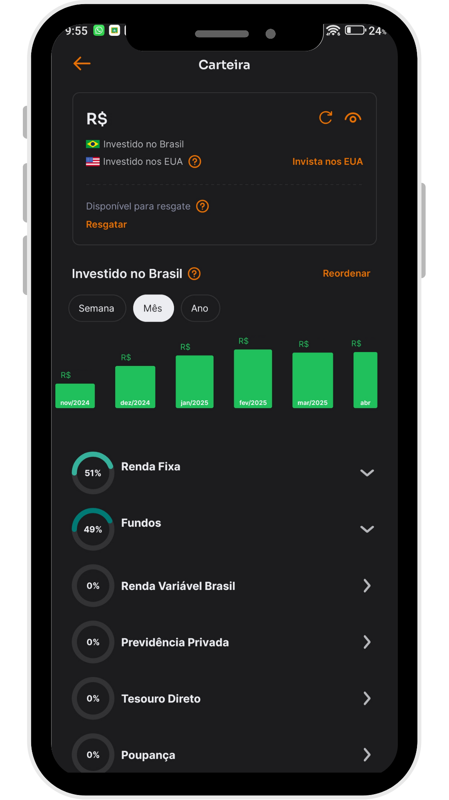
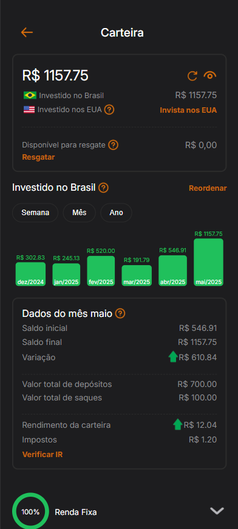
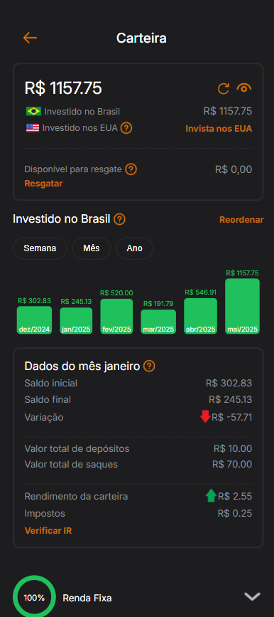

# Nova Funcionalidade Inter

## Sobre a Nova Funcionalidade
A funcionalidade nova está relacionada com a carteira de investimentos do Banco Inter. A carteira não mostra dados detalhados dos investimentos gerais por mês, como rendimentos, depósitos, saques, impostos, apenas mostra o saldo final daquele mês. Por isso, a nova funcionalidade é a exibição de mais informações quando se clica em um mês do gráfico. A tela criada calcula todos os dados automaticamente via JS, só é preciso inserir os depósitos e saques de cada mês e a taxa de juros e impostos gerais. Quando o usuário clica em uma barra do gráfico, as informações são mostradas automaticamente.

Foram feitas duas prints para mostrar as diferenças entre os meses. Entre elas, foi clicado apenas em uma barra do gráfico de um mês diferente.

## Tela Original

## Tela Nova

Print 1:

Print 2:

